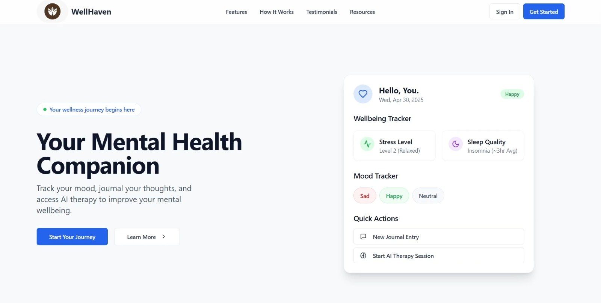
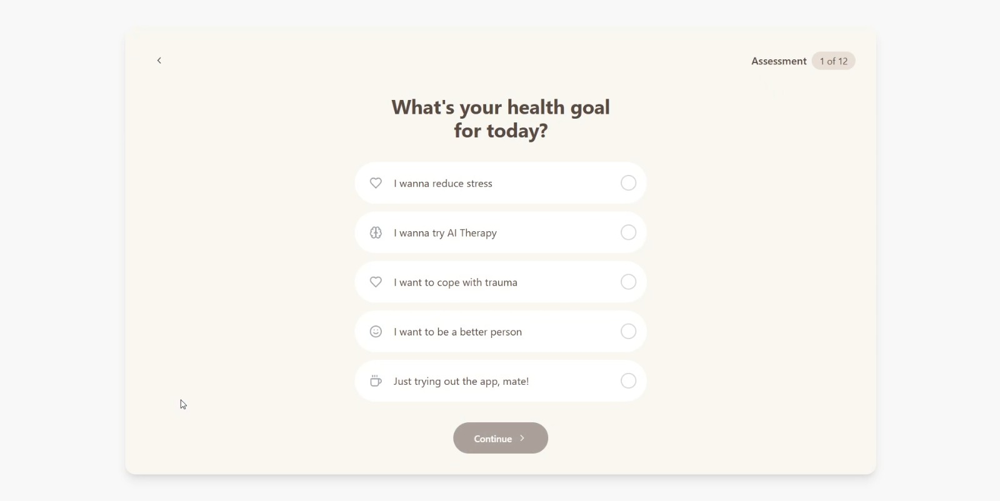
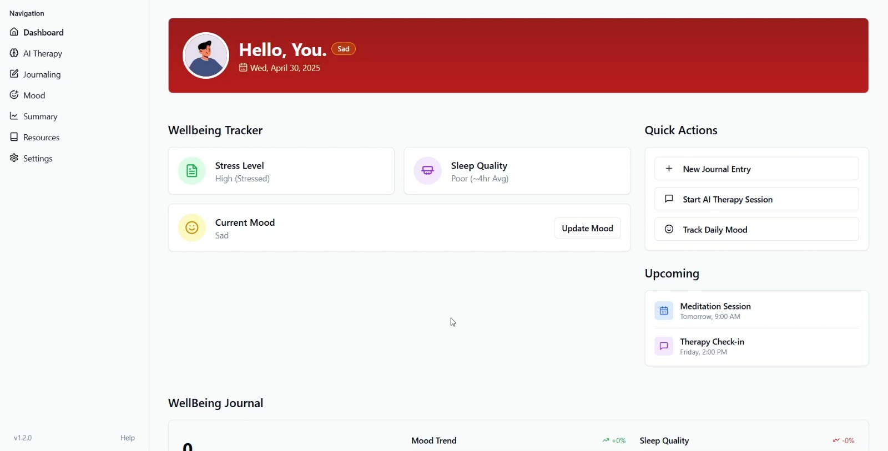
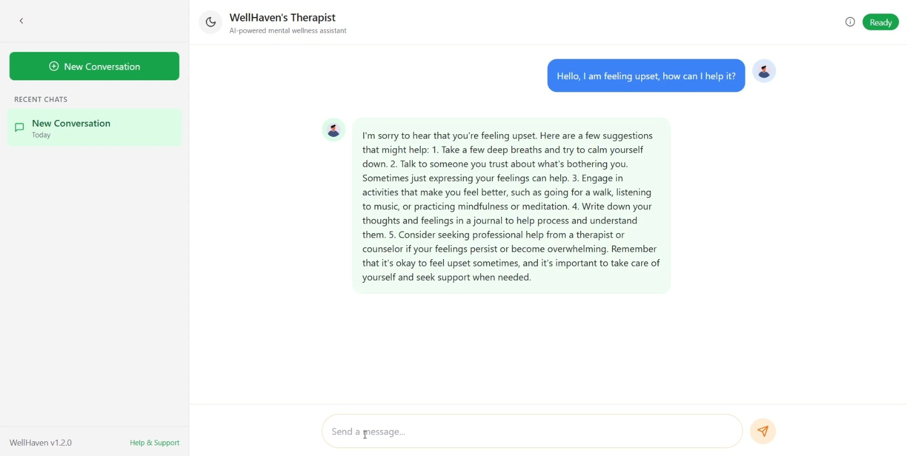
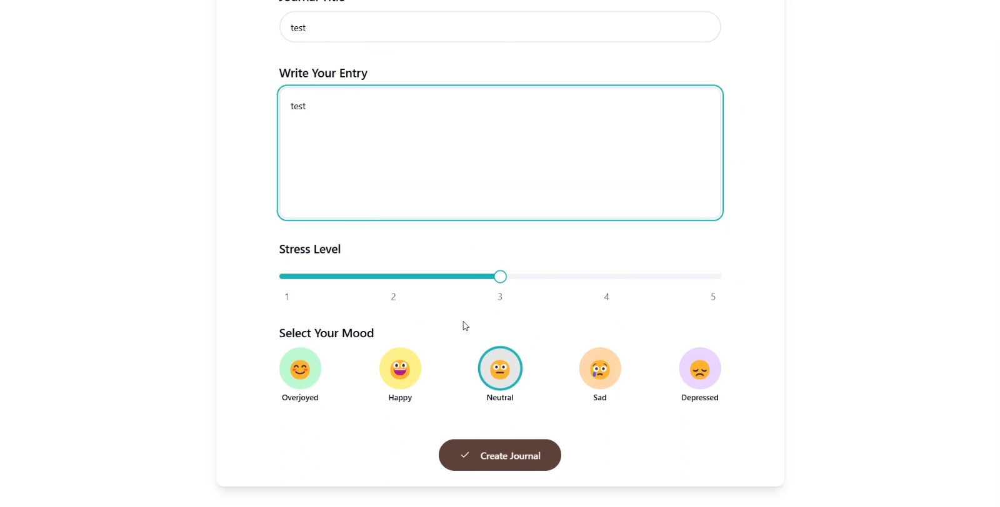
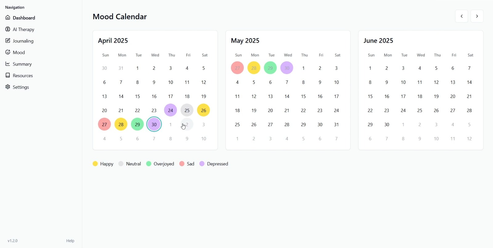
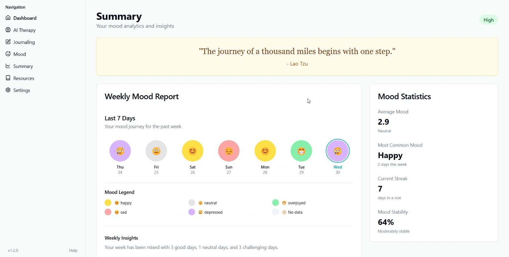

# <div align="center">🌿 WellHaven — Your AI Mental Health Companion</div>

<div align="center">

A full-stack mental wellness platform, powered end-to-end by **Azure OpenAI**, that helps people **track their mood, journal their thoughts, and talk to an AI therapist** — backed by a personalized onboarding assessment and rich analytics that surface patterns in their emotional wellbeing over time.

</div>

## Built with the tools and technologies:

             

---

## ⚡ Powered by Azure OpenAI

WellHaven's core feature — the AI therapy assistant — runs entirely on the **Azure OpenAI Service**. Every conversation is routed through an Azure-hosted GPT-3.5 Turbo deployment via the official `AzureOpenAI` client (`@azure/openai`, `@azure/identity`, `@azure/core-auth`), and the app itself is built and shipped on Azure infrastructure end to end:

- **Azure OpenAI Service** — GPT-3.5 Turbo deployment generates every AI therapy response, with full conversation history replayed on each turn for context-aware replies.
- **Azure Cosmos DB for MongoDB** — stores users, journals, chat sessions, and mood data.
- **Azure Web App** — hosts the production deployment, built and published automatically via GitHub Actions on every push to `main`.

In short: the intelligence layer, the data layer, and the hosting layer are all Microsoft Azure.

## Overview

**WellHaven** is a Next.js 14 web application designed as a personal companion for mental wellbeing. New users complete a guided, multi-step assessment that captures their goals, lifestyle, and baseline emotional state. From there, WellHaven becomes a daily hub where they can log their mood and sleep, keep a private journal, chat with an AI therapy assistant **powered by Azure OpenAI**, and watch their progress unfold through weekly and monthly insight dashboards.



## Features

- **🤖 AI Therapy Assistant, powered by Azure OpenAI** — A conversational chat interface backed by the Azure OpenAI Service (GPT-3.5 Turbo deployment). Full conversation context is preserved across turns, and every chat session is saved so users can revisit, rename, or delete past conversations.
- **🧭 Personalized Onboarding Assessment** — A beautifully animated, multi-step intake flow (powered by Framer Motion) that collects the user's health goal, demographics, mental-health symptoms, medications, stress level, sleep quality, and current mood to tailor the experience.
- **📊 Wellbeing Dashboard** — A live snapshot of the user's current mood, sleep quality, and stress level, complete with trend indicators comparing recent activity against previous periods.
- **📅 Daily Mood & Sleep Tracking** — A calendar-based tracker that enforces one entry per day, letting users record and revise their mood and sleep quality over time.
- **📝 Private Journaling** — Full create / read / update / delete journaling, with each entry tagged by mood and stress level so entries feed directly into the analytics engine.
- **📈 Insights & Analytics** — Weekly mood reports, monthly mood charts (Recharts), summary statistics, and auto-generated mood insights that highlight correlations and patterns in the user's data.
- **📚 Resources & Exercises** — A curated resource library including an interactive guided breathing exercise.
- **⚙️ Settings & Personalization** — Notification preferences, appearance/theme controls, account management, and privacy settings.
- **🔐 Secure Authentication** — Clerk-powered sign-in/sign-up with route-level protection via Next.js middleware; every server action and API route is scoped to the authenticated user.





## Tech Stack

- **AI**: **Azure OpenAI Service** (GPT-3.5 Turbo deployment) — powers the entire AI therapy assistant
- **Framework**: Next.js 14 (App Router, Server Components & Server Actions), React 18
- **Language**: TypeScript
- **Styling**: Tailwind CSS, shadcn/ui, Radix UI primitives, Framer Motion animations
- **Database**: MongoDB (Azure Cosmos DB for MongoDB) via Prisma ORM
- **Authentication**: Clerk
- **Validation**: Zod
- **Charts & Icons**: Recharts, Lucide React
- **Deployment**: **Azure Web App** via GitHub Actions CI/CD

## How the AI Therapy Works

Each message the user sends is authenticated, persisted to the database, and then the **entire conversation history** is replayed to **Azure OpenAI** so the assistant always responds with full context. Both the user message and the AI reply are stored against a `ChatSession`, enabling persistent, resumable conversations.

```typescript
// app/api/chat/route.ts — maintain full conversation context per session
const allMessages = await prisma.chatMessage.findMany({
  where: { chatSessionId: chatSession.id },
  orderBy: { createdAt: "asc" },
});

// Format the entire history for the Azure OpenAI API
const formattedMessages = allMessages.map((msg) => ({
  role: msg.isFromUser ? "user" : "assistant",
  content: msg.content,
}));

// Generate the AI response via Azure OpenAI, then persist it alongside the user's message
const aiResponseContent = await generateChatResponse(formattedMessages);
```

The call to **Azure OpenAI** is centralized in a thin client wrapper built on the official Azure OpenAI SDK:

```typescript
// app/api/chat/azure-openai.ts — Azure OpenAI chat completion
export async function generateChatResponse(
  messages: { role: string; content: string }[],
) {
  const client = getOpenAIClient();
  const response = await client.chat.completions.create({
    messages,
    max_tokens: 800,
    temperature: 0.7,
    top_p: 0.95,
  });
  return response.choices[0].message.content;
}
```



## Data Model

WellHaven uses Prisma with MongoDB (Azure Cosmos DB for MongoDB). The schema is organized around a single `User` (keyed by their Clerk auth ID) with related records for journaling, chat, and daily tracking:

| Model           | Purpose                                                                                                        |
| --------------- | -------------------------------------------------------------------------------------------------------------- |
| **User**        | Profile + onboarding assessment: goal, demographics, medications, symptoms, and baseline stress / sleep / mood |
| **Journal**     | Journal entries tagged with a `mood` and `stressLevel` (1–5)                                                   |
| **ChatSession** | A named AI therapy conversation, backed by Azure OpenAI, belonging to a user                                   |
| **ChatMessage** | Individual messages in a session, flagged as user- or AI-authored                                              |
| **DailyMood**   | One mood + sleep-quality record per user per day (compound-indexed)                                            |





## API & Server Actions

### API Routes

- `POST /api/chat` — Send a message; creates/continues a session and returns the Azure OpenAI-generated reply
- `GET /api/chat/sessions` — List all of the authenticated user's chat sessions
- `GET /api/chat/[sessionId]` — Fetch a single session with its full message history

### Server Actions

- **Onboarding** — `createUser` — validates the full assessment with Zod and upserts the user profile
- **Journaling** — `createJournal`, `updateJournal`, `deleteJournal`
- **Mood Tracking** — `createMood`, `updateMood`, `deleteMood` (one entry per day)
- **AI Therapy** — `updateChatSessionName`, `deleteChatSession`

Every route and action is guarded by Clerk authentication and verifies resource ownership before reading or mutating data.



## Getting Started

```bash
# 1. Install dependencies
npm install

# 2. Generate the Prisma client & push the schema
npx prisma generate
npx prisma db push

# 3. Run the development server
npm run dev
```

Create a `.env` file with the following keys:

```env
# Database (Azure Cosmos DB for MongoDB)
DATABASE_URL=your_mongodb_connection_string

# Clerk Authentication
NEXT_PUBLIC_CLERK_PUBLISHABLE_KEY=your_clerk_publishable_key
CLERK_SECRET_KEY=your_clerk_secret_key

# Azure OpenAI
NEXT_PUBLIC_AZURE_OPENAI_ENDPOINT=your_azure_openai_endpoint
NEXT_PUBLIC_AZURE_OPENAI_API_KEY=your_azure_openai_api_key
```

## Deployment

WellHaven runs on **Microsoft Azure** end to end: the AI therapy assistant is served by the **Azure OpenAI Service**, data is stored in **Azure Cosmos DB for MongoDB**, and the app itself is deployed to an **Azure Web App** through a GitHub Actions pipeline that builds the Next.js app on every push to `main` and publishes the artifact to production.

---

<div align="center">

_WellHaven is a learning project — some features aren't developed to the best._

</div>
